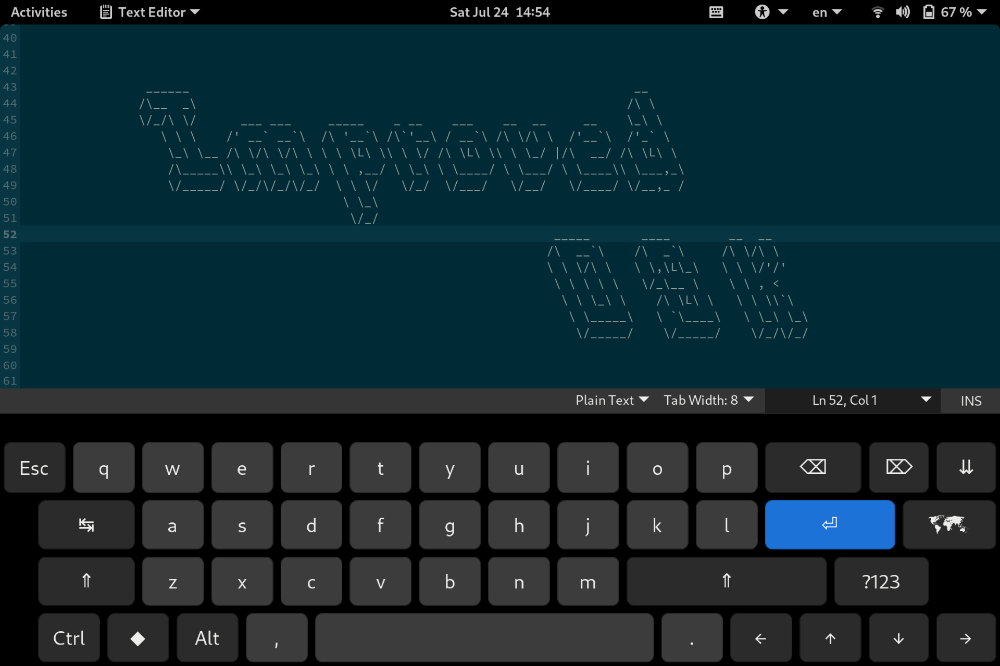

# improved-popos-osk

Improve the stock PopOS OSK, without redefining it completely

Features:
* More buttons like CTRL, F-Keys, Arrow Keys...
* Configurable keyboard size (landscape/portrait)
* Toggle auto keyboard popup on touch input 
* Statusbar indicator to toggle keyboard



## Installation

### From source code

Clone the git repo

```
git clone https://github.com/Apacelus/improved-popos-osk.git ~/.local/share/gnome-shell/extensions/improved-popos-osk@apacelus.github.com
```

### From extensions.gnome.org

Coming soon:tm:

## Activation

After installing and enabling extension, log out and back in to reload Gnome Shell.

## FAQ

### Some symbols are missing...
the keyboard uses unicode characters, try install ttf-symbola on archlinux (AUR) or ttf-ancient-fonts-symbola on ubuntu/debian

### Do i need to enable the OSK in Gnome accessibility settings?
By default the keyboard will popup on touch input events. Enabling the keyboard in the accessibility settings just allows the OSK to popup on non touch input.

### Extension is installed and activated, but keyboard layout doesn't change.
Gnome's default on-screen keyboard, on which this extension is based on, uses `ibus` package, make sure you have it installed.
